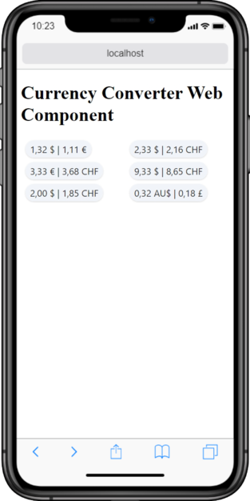

# Currency Converter Web Component

A simple Web Component that converts a given currency to another.

This component uses the [free and open source API from the European Central Bank](https://exchangeratesapi.io/).



## Uasge

```html
<currency-converter
  base-currency="USD"
  value="1.32"
  conversion-currency="EUR"
></currency-converter>
```

## Development

`yarn start` --> Development Server

`yarn build` --> Build dist and demo bundles
